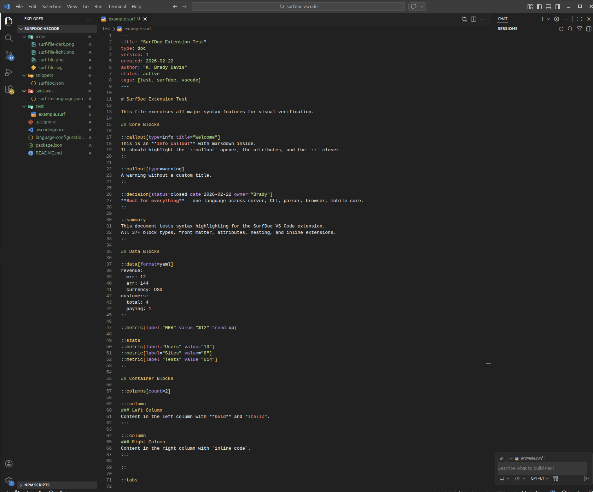

# SurfDoc for VS Code

Language support for **SurfDoc** (`.surf`), a typed document format by [CloudSurf Software](https://cloudsurf.com).



## Features

- **Syntax highlighting** — Front matter (YAML), block directives (`::callout`, `::decision`, `::data`, etc.), attributes, inline extensions, and all standard markdown
- **File icon** — Custom SurfDoc icon in explorer and tabs
- **Snippets** — Quick insertion for all 37+ block types and front matter
- **Folding** — Collapse block directives and front matter sections
- **Bracket matching** — Auto-close `[]` attributes, `()` links, `""` strings

## SurfDoc Syntax

SurfDoc is a markdown superset with typed structured blocks:

```surf
---
title: "My Document"
type: doc
created: 2026-02-22
---

# Hello World

::callout[type=info title="Getting Started"]
SurfDoc adds typed blocks to markdown while remaining
readable as plain text in any editor.
::

::decision[status=closed date=2026-02-22]
Use Rust for the parser — 5x faster than JavaScript alternatives.
::

::columns[count=2]

:::column
Left column content.
:::

:::column
Right column content.
:::

::
```

## Block Types

**Core**: `callout`, `decision`, `summary`, `quote`, `figure`, `code`, `tasks`
**Data**: `data`, `metric`, `stats`, `timeline`, `chart`
**Container**: `columns`, `tabs`, `details`, `section`
**Web/Landing**: `hero`, `cta`, `nav`, `page`, `site`, `features`, `steps`, `comparison`, `pricing-table`, `faq`, `testimonial`, `footer`, `form`, `gallery`, `embed`, `hero-image`, `style`, `before-after`, `pipeline`, `product-card`, `logo`, `toc`, `divider`
**Conversation**: `turn`, `alternatives`
**Reference**: `related`, `footnote`, `progress`

## Requirements

VS Code 1.78 or later.

## Links

- [SurfDoc Specification](https://doc.surf)
- [surf-parse on GitHub](https://github.com/cloudsurf-software/surf-parse)
- [CloudSurf Software](https://cloudsurf.com)
